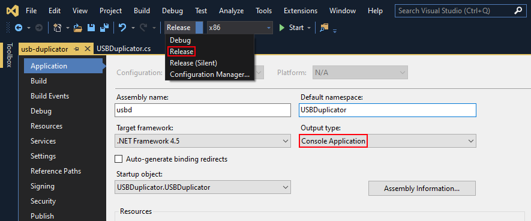
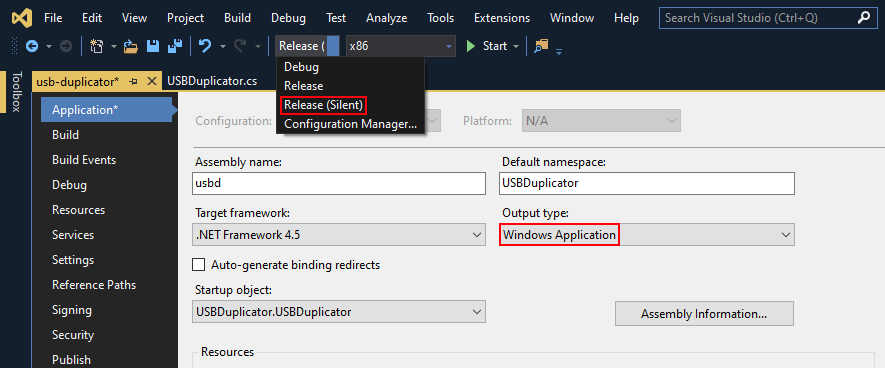

# About <a href="https://docs.microsoft.com/en-us/dotnet/framework/whats-new/#v45"></a>
_USB Duplicator_ is an application that copies all data from USB drives to a folder, when they are plugged in.

# License <a href="https://github.com/UnexomWid/usb-duplicator/blob/master/LICENSE"></a>

USB Duplicator was created by [UnexomWid](http://unexomwid.me). It is licensed under the [GNU GPLv3](https://www.gnu.org/licenses/gpl-3.0.en.html) license.

# Disclaimer

#### By using USB Duplicator, you agree to the following:

USB Duplicator should **NOT** be used for any malicious purposes. It was created to be used as a backup solution for **personal USB drives**.

_I am **NOT** responsible for any type of misuses and/or damages done by this software, and I cannot be held responsible for your actions, whether or not they are malicious. Use this software at **your own risk and responsibility**._

# Releases

>Note: versions with the suffix **R** are considered stable releases, while those with the suffix **D** are considered unstable.

[v2.0R](https://github.com/UnexomWid/usb-duplicator/releases/tag/v2.0R) - September 4, 2019

# USB Duplicator

USB Duplicator listens for drive activity. When a USB drive is plugged in, the application begins copying all files from the drive to the working directory, in a directory with the following name:

```
[{ID}_{DAY}-{MONTH}-{YEAR}_{HOUR}-{MINUTE}-{SECOND}-{MILLISECOND}]{DRIVE_NAME}
```

Where:

* _{ID}_ - An arbitrary ID that is used to minimize the chances of 2 drives being duplicated in the same directory.
* _{DAY}_ - The current day
* _{MONTH}_ - The current month
* _{YEAR}_ - The current year
* _{HOUR}_ - The current hour
* _{MINUTE}_ - The current minute
* _{SECOND}_ - The current second
* _{MILLISECOND}_ - The current millisecond
* _{DRIVE_NAME}_ - The drive name, or `USB Drive` if the drive doesn't have a name

To see what arguments the application accepts, launch it with the `-h` or `--help` flag (_e.g. `usbd.exe -h`_), or read below.

> Note that It might take a few seconds for the application to detect the USB Drive.

# Whitelist & Blacklist

By default, USB Duplicator copies files from _all_ USB drives when they are plugged in. However, you can specify which drives you wish to copy from.

## Marked Drives

A drive is considered _marked_ if it contains a file called `usbd` in the root (_e.g. if the drive letter is *F:\\*, then the drive will be considered marked if the file *F:\\usbd* exists_).

The marking file doesn't need to have any content, it just needs to exist.

## Whitelist

You can switch to the whitelisting mode by launching the application with the `-w` or `--whitelist` flag. In this mode, **only marked drives** will be duplicated. Unmarked drives will be ignored.

> This is useful when you have specific drives that you want to back up.

## Blacklist

You can switch to the blacklisting mode by launching the appliation with the `b` or `--blacklist` flag. In this mode, **only unmarked drives** will be duplicated. Marked drives will be ignored.

> This is useful when you have specific drives that you don't want to back up.

# Working Directory

The default working directory is the directory where the application is launched from.

To change it, simply launch the application with the desired working directory as an argument:

```
usbd.exe "D:/path/goes/here"

usbd.exe -b "D:/path/goes/here"

usbd.exe "D:/path/goes/here" --whitelist
```

> If the path contains spaces, it must be wrapped in quotes.
>
> If the path contains spaces and it isn't wrapped in quotes, only the first space-less string will be considered as the path (_e.g. `usbd.exe path/with spaces/goes/here` will launch the application with the current directory set to "path/with"_).
>
> If multiple whitelist/blacklist flags are passed, the last one will be used (_e.g. `usbd.exe -w -b -w "path/goes/here" -b` will launch the application with blacklist mode enabled and with the current directory set to "path/goes/here"_).

# Silent Mode

By default, USB Duplicator logs all information in a console. However, if you don't want the application to open a console, and instead to work silently in the background, you can:

* use the _silent_ version, provided in each release
* compile the code with the "SILENT" conditional compilation symbol

# Compiling the Code

You can compile the code using any tools you want. However, below you'll find an easy way to do it. For this tutorial, Visual Studio 2019 is used, but other versions should work just fine. You can compile to any platform (_x86/x64_).

## Release

Select the `Release` configuration, and the `Console Application` output type (_Project->Properties->Application_).

<p align="center">
   
</p>

You can also choose the `Windows Application` output type, if you want the application to have a separate console window all the time.

## Release (Silent)

Select the `Release (Silent)` configuration, and the `Windows Application` output type (_Project->Properties->Application_).

<p align="center">
   
</p>
